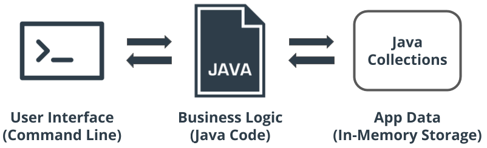
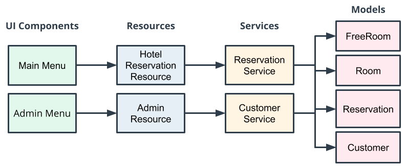

## Udacity Java Programmer - Project 1 - Hotel Reservation Application

This project is about designing and implementing a Java hotel reservation application. The hotel reservation application will allow customers to find and book a hotel room based on room availability. This project demonstrates abilities to design classes using OOP, organize and process data with collections, and use common Java types.

---

### Main Components of the App

The major components of the Hotel Reservation Application will consist of the following:

1. _CLI for the User Interface_ - Command Line Interface will be used so the user can enter commands to search for available rooms, book rooms, and so on.
2. _Java code_ - The second main component is the Java code itself—this is where business logic for the app resides.
3. _Java collections_ - For in-memory storage of the data needed for the app, such as the users, rooms, availability, and so on.

Image Source: Udacity

---

### Application Architecture

The app is separated into the following layers:

1. **User interface (UI)** - A main menu for the users who want to book a room, and an admin menu for administrative functions.

2. **Resources** - It will act as Application Programming Interface (API) to UI.

3. **Services** - Communicates with resources, and each other, to build the business logic necessary to provide feedback to UI.

4. **Data models** - Used to represent the domain used within the system (e.g., rooms, reservations, and customers).

Image Source: Udacity

### Project Requirement & Setup
This project was built on java v20.0.2 You need to have JDK installed to run this. Also IDE like IntelliJ or Vscode is required.
> For Vscode, [Java Language Pack](https://marketplace.visualstudio.com/items?itemName=vscjava.vscode-java-pack) extensions are required.
1. Clone the repository
2. Open project in IntelliJ or Vscode
3. Go to src/HotelApplication.java file & run the `main()` function
